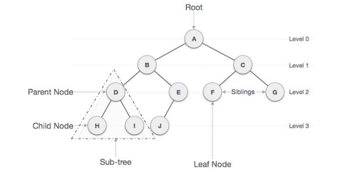

# Binary Trees

## Terminology

Root - Root is a special node in a tree. The entire tree originates from it. It does not have a parent.

Parent Node - Parent node is an immediate predecessor of a node.

Child Node - All immediate successors of a node are its children.

Leaf - Node which does not have any child is called as leaf

Interior Nodes - nodes that are not leaves

Edge - Edge is a connection between one node to another. It is a line between two nodes or a node and a leaf.

Siblings - Nodes with the same parent are called Siblings.

Path / Traversing - Path is a number of successive edges from source node to destination node.

Height of Node - Height of a node represents the number of edges on the longest downward path between that node and a leaf.

Levels of node - Level of a node represents the generation of a node. If the root node is at level 0, then its next child node is at level 1, its grandchild is at level 2, and so on

Depth of Node - the length of its path to its root

Degree of Node - Degree of a node represents the number of children of a node.

Sub tree - Descendants of a node represent subtree. 

## Types of Binary Trees

Binary Tree - In a Binary tree, every node can have at most 2 children, left and right.  In diagram below.

Full Binary Tree - If every node in a tree has either 0 or 2 children, then the tree is called a full tree.

Complete Binary Tree - A Binary Tree is complete Binary Tree if all levels are completely filled except possibly the last level and the last level has all keys as left as possible.

Perfect Binary Tree - It is a binary tree in which all interior nodes have two children and all leaves have the same depth or same level. (ie Full and Complete)

Balanced Tree - If the height of the left and right subtree at any node differs at most by 1, then the tree is called a balanced tree.

Binary Search Tree - It is a binary tree with binary search property. Binary search property states that the value or key of the left node is less than its parent and value or key of right node is greater than its parent. And this is true for all nodes.

# Reference

https://www.mygreatlearning.com/blog/understanding-trees-in-data-structures/